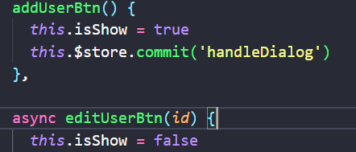

# 一、创建项目并安装所需的依赖

1. 安装 vue 脚手架
2. 通过 Vue 脚手架创建项目
3. 配置 vue 路由
4. 配置 Element-UI
5. 配置 axios 库组件库
6. 初始化 git 远程仓库

> 生成公钥


> 找到公钥保存位置的文件将公钥粘到gitee上


> 添加后在终端输入
>
> ```
> ssh -T git@gitee.com
> ```
>
> 首次使用需要确认并添加主机到本机SSH可信列表。若返回 `Hi XXX! You've successfully authenticated, but Gitee.com does not provide shell access.` 内容，则证明添加成功。

 

7. 将本地项目托管到 Github 或 gitee 中

> 创建仓库


> git全局设置（没有安装git要安装）

```
git config --global user.name "gitee123"
git config --global user.email "574957612@qq.com"
```

> 添加远程仓库

在目录下打开powerShell将文件添加到仓库

```
git remote add origin https://gitee.com/gitWang123/vue-manage.git
```

将本地和远程的仓库做合并

```
git push -u origin "master"
```


# 二、后台项目的环境安装配置

### 1. 导入接口文件

> 使用phpstudy导入不了，用了Navicat

### 2. 使用PowerShell(管理员)安装依赖

进入接口文档的目录下在PowerShell(管理员)安装依赖`npm install`

### 3. 使用node运行app.js

`node .\app.js`

### 4. 安装Apifox测试接口是否正常

> 使用方法看官方文档

# 三、登录与退出功能

### 1. 登录业务流程

1. 在登录页面输入用户名和密码
2. 调用后台接口进行验证
3. 过验证之后，根据后台的响应状态跳转到项目主页

### 2. 登录业务的相关技术点

- **不存在跨域**

  - 通过cookie在客户端记录状态

  - 通过session在服务器端记录状态

- **存在跨域**
  - 通过token方式维持状态

### 3. token原理分析


### 4. 登录功能的实现

##### 4.1 查看git状态

`git status`


> 如果报错就到根目录下cmd  `git add .`
>
> 然后再`git status`

##### 4.2 创建登录的分支

创建：

`git checkout -b xxx(login)`

查看：

`git branch`	

上传代码

```
git status  // 查看状态
git add .   //
git commit -m "可以输入关键信息"  // 上传到本地仓库
git branch  // 查看分支
git checkout xxx // 切换分支
git merge xxx  // 将xxx分支合并到当前分支
git push  // 推送到gitee
git push -u origin xxxx  // 推送到远程仓库中origin下的子仓库xxx
```

##### 4.3 登录逻辑

- 将登录成功之后的token,保存到客户端的sessionStorage中
- 项目中除了登录之外的其他API接口，必须在登录之后才能访问
- token只应在当前网站打开期间生效，所以将token保存在sessionStorage中

```js
// 在el-form自定义规则中有一个validate回调函数，回调函数有个值valid是一个boolean，通过判断这个值确认是否符合输入正确
signIn() {
      // 判断是否符合规定
      this.$refs.loginFormRef.validate(async (valid) => {
        // 不符合停止
        if (!valid) return;
        // 符合发送数据请求
        const res = await checkLogin(this.loginForm);
        if (res.meta.status === 200) {
          this.$message.success(res.meta.msg);
          // 将登录成功之后的token,保存到客户端的sessionStorage中
          // 项目中除了登录之外的其他API接口，必须在登录之后才能访问
          //  token只应在当前网站打开期间生效，所以将token保存在sessionStorage中I
          sessionStorage.setItem("token" ,  res.data.token)
          // 通过编程式导航跳转到后台主页，路由地址是/home
          this.$router.push('/home')
        } else {
          this.$message.error(res.meta.msg);
        }
      });
    },
```

- 通过编程式导航跳转到后台主页，路由地址是/home

> 使用路由守卫beforeEach处理代码

```js
router.beforeEach((to,from,next) =>{
  // 去登录页直接放行
  if(to.path === '/login') return next()
  // 获取token值
  const tokenStr = sessionStorage.getItem('token');
  // 没有token，强制跳回login页
  if(!tokenStr) return next('/login')
  // 有token
  next()
})
```

##### 4.4 退出登录逻辑

- 点击退出按钮时销毁token

- 判断没有token强制跳转到/login

##### 4.5 登录注册页面的样式逻辑

> 总共有两个大的容器，每个容器里面包含左右两个部分，用定位排列一左一右


> 两个大容器重叠，通过js添加类名，通过改变定位`transform: transitionX`改变方块的移动，使用`z-index`改变层级

##### 4.6 elementUI的彩色消息提示使用方法

> 1. 导入message：message要使用全局注册的方法

```js
// 消息提示框
import { Message } from 'element-ui'
  // 需要全局挂载
Vue.prototype.$message = Message
```

> 2. 使用

# 四、侧边栏的实现逻辑

> bug1：侧边栏展开收缩时卡顿

**原因是因为我给el-menu设置了width:100%**

> bug2：二级菜单默认展开

**将default-active属性删除**


### 1. 控制侧边栏显示与隐藏的按钮

> 1. 控制收缩的逻辑就是isCollapse这个属性，因为要在header组件中控制aside组件，存在跨组件的场景，所以要使用vuex
>
> 2. 将isCollapse放到vuex中，在mutations中将isCollapse取一下反
> 3. header点击按钮时commit传到mutations，调用handleMenu方法，取反并赋值给state中的isCollapse
> 4. 在aside中通过...mapState拿到isCollapse并使用到el-menu中

### 2. logo的切换

> 使用v-if 、v-else 通过判断isCollapse来决定显示字体还是头像

```js
 <div class="brandBox">
    // 因为isCollapse默认是false所以这里要取反 
    <h3 class="brand" v-if="!isCollapse">后台管理系统</h3>
	
 </div>
```

### 2. 数据请求与渲染

##### 2.1 数据请求

> bug：在发送请求时报错`无效token`
>
> 解决：在请求拦截器中加入请求头`  config.headers.Authorization = window.sessionStorage.getItem('token');`

**封装request**

> 在request文件中设置基础url，请求拦截器和响应拦截器

```js
import axios from 'axios'

const instance = axios.create({
    baseURL:'https://lianghj.top:8888/api/private/v1/',
    timeout:5000
})
// 请求拦截器
instance.interceptors.request.use(config=>{
    // console.log('每一次发起请求前，都会先执行这里的代码');
    // console.log(config) // 本次请求的配置信息
    // 解决无效token
    config.headers.Authorization = window.sessionStorage.getItem('token');
    return config
},err=>{
    return Promise.reject(err)
})

// 响应拦截器
instance.interceptors.response.use(res=>{
    // console.log("每一次收到响应，都会先执行这里的代码");
    return res.data
},err=>{
    return Promise.reject(err)
})

export default instance
```

**封装API**

> 在api函数文件中引入request文件
>
> 暴露请求方法，例如：`export const getAsideFun = () => {return request.get('/menus')}`
>
> 携带参数：

```
// 这里是传参不是拼接
// 请求登录用户账号
export const checkLogin = (loginForm) =>{return request.post('/login',loginForm)}
```

**组件中发送请求**

> 1. 引入方法`import {getAsideFun} from 'xxxx'`
> 2. 在methods中封装一个请求函数`getRequest(){}`在里面发送请求这里需要使用异步操作

```js
async getRequest() {
    const res = await getAsideFun()  // 如果要传参则在括号里写上就可以了
    this.menuList = res.data
    console.log(res.data)
}
```

> 3. 在`created(){}`中调用该函数`this.getRequest()`

```
async created() {
	this.getRequest()
}
```

##### 2.2 渲染数据

> 这里需要强调的是el-submenu中需要有一个index，这个index只接收字符串，所以这里要使用拼接的方法或者String()

```js
<el-submenu :index="String(item.id)" v-for="item in menuList" :key="item.id">
或
<el-submenu :index="item.id+''" v-for="item in menuList" :key="item.id">
```

##### 2.3 优化功能

> 二级菜单高亮：将当前的路径保存到sessionStorage中，下次启用的时候从sessionStorage读取并填到default-active中

```js
// 保存链接的激活状态
saveNavState(){
    // 获取当前路由的路径
    this.activePath = sessionStorage.setItem("activePath" , this.$route.path)
    // 在点击别的组件时给activePath重新赋下值
    this.activePath = this.$route.path
}
```

> 在程序开始创建的时候就获取sessionStorage的值放到default-active中达到刷新不会高亮就消失了的效果

```js
created() {
    // 一开始就赋值到activePath上
    this.activePath = sessionStorage.getItem("activePath")
}
```

> 但是一但再点别的链接就没有高亮了，所以应该在点击别的组件时给activePath重新赋下值

```js
this.activePath = this.$route.path
```

# 五、面包屑导航

> 这个部分主要用的是`$route.matched`来实现

**$route.matched**
类型:Array
一个数组，包含当前路由的所有嵌套路径片段的路由记录 。路由记录就是 routes 配置数组中的对象副本(meta) (还有在 children 数组)。

> 当点击选项时，将对应的meta > title 打印出来

```js
// router>index.js
// 定义这些路径名
meta:{
    title:'用户管理 > 用户列表'
}

// Tags.vue

<el-breadcrumb-item v-for="item in breadList" :key="item.path" :to="item.path">
    {{item.meta.title}}
</el-breadcrumb-item>


computed:{
    // 使用计算属性的返回值拿到路径数组
    breadList(){
        return this.$route.matched
    }
}
```


# 六、User组件的内容

### 1. 搜索与添加

> 这里需要注意的就是要使用响应式布局
>
> 搜索框占8格，添加用户按钮占4格，中间隔20

### 2. 用户列表展示区

> 这里需要注意的是状态那里要使用作用域插槽

```js
<el-table-column label="状态">
    <template v-slot="scope">
        <el-switch v-model="scope.row.mg_state"></el-switch>
	</template>
</el-table-column>
<el-table-column label="操作">
        <!-- enterable鼠标是否可进入到 tooltip 中 -->
    <template v-slot="scope">
        <el-tooltip effect="dark" content="修改" placement="top" :enterable="false">
            <el-button type="primary" icon="el-icon-edit" circle></el-button>
    	</el-tooltip>
        <el-tooltip effect="dark" content="删除" placement="top" :enterable="false">
            <el-button type="danger" icon="el-icon-delete" circle></el-button>
        </el-tooltip>
        <el-tooltip effect="dark" content="角色管理" placement="top" :enterable="false">
            <el-button type="warning" icon="el-icon-setting" circle></el-button>
        </el-tooltip>
    </template>
</el-table-column>
```

### 3. 分页

> bug：点击页码的时候报错`[Vue warn]: Error in render: "TypeError: Cannot read properties of null (reading 'pagenum')"`

**原因在于数据请求时代码写错**

```js
 async getRequest() {
      // const res = await getUserListFun({...this.queryInfoParams})
      const res = await getUserListFun(this.queryInfoParams)
      // this.queryInfoParams = res.data
      if (res.meta.status != 200) {
        return this.$message.error(res.meta.msg)
      }
      this.userList = res.data.users
      this.total = res.data.total
      // console.log(res);
    },
  
 // 这里的 this.queryInfoParams = res.data
 // 我理解为上面发送请求时，接收到的数据需要将它赋值给queryInfoParams，但其实不用，这里只是传参过去而已
```

> 实现逻辑：当点击页码时将当前的页码值作为形参传到函数中，再将改页码值赋值给变量

```js
 <el-pagination 
    @size-change="handleSizeChange" 
    @current-change="handleCurrentChange"
    :current-page="queryInfoParams.pagenum" 
    :page-sizes="[1, 2, 5, 10]" 
    :page-size="queryInfoParams.pagesize"
    layout="total, sizes, prev, pager, next, jumper" :total="total">
 </el-pagination>


// 监听 pagesize 改变事件
    handleSizeChange(newSize) {
      console.log(newSize)
      this.queryInfoParams.pagesize = newSize
      this.getRequest()
    },
    // 监听 pagenum 改变事件
    handleCurrentChange(newPage) {
      console.log(newPage)
      this.queryInfoParams.pagenum = newPage
      this.getRequest()
    },
```

### 4. switch 开关状态的改变

> 调用自带的change函数将`scope.row`传给函数，再调用api接口更新到数据库
>
> 更新失败时要充值一下状态

```js
// 接口函数
export const changeStateFun = (userInfo) =>{return request.put(`users/${userInfo.id}/state/${userInfo.mg_state}`)}

// 监听 switch 开关状态的改变
    async userStateChange(userInfo){
      const res = await changeStateFun(userInfo)
      if(res.meta.status != 200 ){
        // 修改失败要重置回去
        userInfo.mg_state = !userInfo.mg_state
        return this.$message.error(res.meta.msg)
      }
      this.$message.success(res.meta.msg)
    }
```

### 5. 搜索功能和一键清空

> 因为后台已经写好了，所以这里的搜索不需要什么代码逻辑，只需要给搜索按钮绑定一个点击事件，点击搜素时发送请求
>
> 一键清空功能是使用了element-ui的clear方法，给el-input加上clearable（clearable=“true”）属性，然后添加一个点击事件，点击时发送请求

```js
<el-input placeholder="请输入内容" clearable @clear="getRequest" v-model="queryInfoParams.query">
    <el-button slot="append" icon="el-icon-search" @click="getRequest"></el-button>
</el-input>
```

### 6. 添加用户

> 这里的对话框我是抽离成为一个组件，使user组件不会太臃肿

##### 6.1  使用添加用户对话框需要定义**“添加用户的表单数据”**和**“添加表单的验证规则”**

这里的邮箱和电话要用到自定义规则

```js
data(){
    // 验证邮箱规则
        let checkEmail = (rule, value, callback) => {
            // 验证邮箱的正则表达式
            const regEmail = /^([a-zA-Z0-9_-])+@([a-zA-Z0-9_-])+(\.[a-zA-Z0-9_-])+/
            if (regEmail.test(value)) {
                // 合法邮箱
                return callback()
            }
            // 不合法
            callback(new Error('请输入合法邮箱'))
        }

        // 验证手机号规则
        let checkMobile = (rule, value, callback) => {
            const regMobile = /^(0|86|17951)?(13[0-9]|15[012356789]|17[678]|18[0-9]|14[57])[0-9]{8}$/
            if (regMobile.test(value)) {
                return callback()
            }
            // 抛出错误信息
            callback(new Error('请输入合法手机号'))
        }
    return {
        // 添加用户 的表单数据
            addFrom: {
                username: '',
                password: '',
                email: '',
                mobile: ''
            },
            // 添加表单的验证规则对象
            addFormRules: {
                username: [
                    { required: true, message: "请输入用户名称", trigger: "blur" },
                    { min: 3, max: 8, message: "长度在 3 到 8 个字符", trigger: "blur" },
                ],
                password: [
                    { required: true, message: "请输入用户密码", trigger: "blur" },
                    {
                        min: 6,
                        max: 16,
                        message: "长度在 6 到 16 个字符",
                        trigger: "blur",
                    },
                ],
                email: [
                    { required: true, message: "请输入邮箱", trigger: "blur" },
                    // validator:校验是否输入了邮箱
                    { validator: checkEmail, trigger: 'blur' }
                ],
                mobile: [
                    { required: true, message: "请输入手机号", trigger: "blur" },
                    // validator:校验是否输入了邮箱
                    { validator: checkMobile, trigger: 'blur' }
                ]
            }
    }
}
```

> 控制显示隐藏的是`dialogVisible`属性，因为涉及跨组件，所以要把这个属性放到vuex中
>
> vuex中需要有两个函数，一个是给`dialogVisible`取反，一个是点击取消或者x按钮时关闭对话框

```js
// Dialog.vue

 <el-dialog title="提示" :visible.sync="dialogVisible" width="40%" :before-close="handleDialogFun" @close="DialogClosed">
<el-form :model="addFrom" :rules="addFormRules" ref="addFromRef" label-width="80px">

methods: {
    handleDialogFun() {
        this.$store.commit('DialogClose')
    },
        
},

// vuex 	
handleDialog(state){
    state.dialogVisible = !state.dialogVisible
},
DialogClose(state){
     state.dialogVisible = false
}
```

##### 6.2 重置对话框的内容

> 给el-dialog绑定一个close事件，通过ref调用restFields函数重置内容

```js
DialogClosed(){
    this.$refs.addFromRef.resetFields()
}
```

### 7. 修改用户信息

##### 7.1 对话框逻辑

> 在Dialog.vue中多来一个el-dialog，在User.vue中定义一个isShow变量，通过props传到Dialog组件，当点击添加时修改isShow的布尔值控制显示添加的对话框，点击修改时取反显示修改的对话框



```js
<DialogView  :user-info="queryInfoParams" :is-show-this="isShow" :edit-info="EditInfo">
```

##### 7.2 点击修改按钮查询数据放到对话框

> 当点击修改按钮时要将当前数据的id传到函数中，拿着id去查询数据


> 接收参数，并发送请求

```js
async editUserBtn(id) {
      this.isShow = false
      const res = await SelectUserFun(id)
      if (res.meta.status != 200) return this.$message.error(res.meta.msg)
      // 将拿到的数据存到EditInfo中
      this.EditInfo = res.data
      // 关闭对话框
      this.$store.commit('handleDialog')
    }
```

> 将拿到的数据存到EditInfo中，再用props传到Dialog，Dialog对话框读取改数据

```js
:edit-info="EditInfo"

 <el-form :model="EditInfo" :rules="addFormRules" ref="addFormRef" label-width="80px">
     <el-form-item label="用户名">
         <el-input disabled v-model="EditInfo.username" type="text"></el-input>
	</el-form-item>
    <el-form-item label="邮箱" prop="email">
        <el-input v-model="EditInfo.email" type="email"></el-input>
    </el-form-item>
    <el-form-item label="手机号码" prop="mobile">
        <el-input v-model="EditInfo.mobile"></el-input>
    </el-form-item>
</el-form>
```

这里的规则判断依旧使用添加用户的判断，还有关闭对话框恢复初始状态

##### 7.3 点击“确定”的逻辑

> 点击确定时来到EditUserInfo函数，然后会先预校验数据，没问题再提交数据
>
> 这里需要拼接一个id值和传一个有email、mobile的对象

```js
EditUserInfo() {
    // 预校验
    this.$refs.addFormRef.validate(async valid => {
    // validate返回一个boolean类型的值 表示验证成功或失败
        // 修改不成功
        if (!valid) return
        const res = await EditUserFun(this.EditInfo.id, {
            email: this.EditInfo.email,
            mobile: this.EditInfo.mobile
        })
        if (res.meta.status != 200) {
            return this.$message.error(res.meta.msg)
        }
        this.$message.success(res.meta.msg)
        // 关闭对话框
        this.$store.commit('DialogClose')
        // 使用eventBus传值：获取新列表，将数据传到User.vue
        const newList = await getUserListFun(this.userInfo)
        bus.$emit('refreshList', newList) 
    })
```

因为要传对象，在api中要使用扩展运算符用于取出参数对象中的所有可遍历属性，拷贝到当前对象之中

```js
export const EditUserFun = (id,obj) => {return request.put('/users/'+id , {...obj})}
```

**刷新用户列表**

> 先发送好友列表请求，将请求回来的数据通过eventBus传到User.vue再将数据赋值给userList和total

```js
// User.vue
bus.$on('refreshList' , val=>{
      this.userList = val.data.users
      this.total = val.data.total
    })
```

这里还使用到了eventBus中间件传值（不需要安装）


# 七、权限管理

### 权限分配

通过权限管理模块控制不同的用户可以进行哪些操作，具体可以通过角色的方式进行控制，即每个用户分配
一个特定的角色，角色包括不同的功能权限。

### 1. 角色列表

##### 1.1 获取角色列表

获取角色列表保存到rolesList:[]中

```js
data(){
    return {
        rolesList:[]
    }
}


async getRequest() {
    const res = await getRolesListFun()

    if (res.meta.status !== 200) {
        return this.$message.error(res.meta.msg)
    }
    this.rolesList = res.data
},
```

##### 1.2 添加角色和编辑角色

> 1. 用户输入信息后，首先需要预校验，校验通过了提交数据
>
> 2. 这里使用一个函数通过判断传进来的形参是添加还是编辑
>
> 3. 编辑角色则需要分两步走
>    1. 点击编辑按钮将当前项id传到函数中，发送请求查询改成员信息，返回的数据保存在一个变量中，再通过v-model将数据渲染到输入框
>    2. 当点击确定时将当前项的id和角色名称、角色描述都传到后台，修改数据，然后重新发起请求刷新列表

```js
sendData(sendType) {
            if (sendType == 'add') {
                // 发送请求
                this.$refs.addRoleFormRef.validate(async valid => {
                    if (!valid) return
                    const res = await addRolesFun(this.addRoleForm)
                    if (res.meta.status != 201) {
                        return this.$message.error("创建失败！")
                    }
                    this.$message.success('创建成功！')
                    this.DialogTF = false
                    this.getRequest()
                })
            } else if (sendType == 'edit') {
                // 预校验
                this.$refs.addRoleFormRef.validate(async valid => {
                    if (!valid) return
                    const res = await EditUserFun('roles', this.roleInfo.roleId, {
                        roleName: this.roleInfo.roleName,
                        roleDesc: this.roleInfo.roleDesc

                    })
                    if (res.meta.status !== 200) {
                        return this.$message.error('修改失败！')
                    }
                    this.$message.success('修改成功！')
                    this.DialogTF = false
                    this.getRequest()
                })
            }
    },
        
        
 // api
// 查询用户信息
export const SelectUserFun = (path,id) => {return request.get(`/${path}/`+id)}
// 修改用户信息
export const EditUserFun = (path , id,obj) => {return request.put(`/${path}/`+id , {...obj})}
```

##### 1.3 删除角色

> 1. 点击删除按钮，弹出提示
>
>    ​	如果用户确认删除，则返回值为字符串confirm
>
>    ​	如果用户取消了删除，则返回值为字符串cancel
>
> 2. 判断字符串，发送请求，删除数据，刷新列表

```js
async deleteRole(id) {
            const confirmRes = await this.$confirm('此操作将永久删除该用户, 是否继续?', '提示',
                {
                    confirmButtonText: '确定',
                    cancelButtonText: '取消',
                    type: 'warning'
                }
                // 捕捉错误
            ).catch(err => err)
            // 如果用户确认删除，则返回值为字符串confirm
            // 如果用户取消了删除，则返回值为字符串cancel
            if (confirmRes !== 'confirm') {
                return this.$message.info('已取消删除')
            }
            const res = await DeleteUser('roles', id)
            this.$message.success(res.meta.msg)
            // 刷新列表
            this.getRequest()
        },
```

> 最后关闭对话框要初始化

```js
// 关闭对话框清空数据
DialogClose() {
    this.$refs.addRoleFormRef.resetFields()
}
```

##### 1.4 展开列

> 用element-ui的expend类型
>
> 扩展行中要用到作用域插槽，在行里面分为两个列
>
> 在行里面还要使用响应式布局，在第二列里面又分为一行>两列


扩展列中的标签要使用到嵌套循环，就是一级循环scope.row的children，二级循环一级的children，三级循环二级的children

```js
v-for="firstItem in scope.row.children"
v-for="secondItem in firstItem.children"
v-for="threeItem in secondItem.children"
```

##### 1.4.1 删除角色所拥有的权限

> 给每一个权限加上“x”按钮并绑定删除事件
>
> “x”只是给el-tag加上一个*closable*属性

删除该权限需要传入当前角色的所有数据，还有当前权限的id，这个id来自前面角色数据中的children下的id

当前角色的数据主要用于最后的赋值防止扩展列闭合，删除的主要逻辑还是依靠children下的id

```js
async removeRight(role, rightId) {
    const confirmRes = await this.$confirm('此操作将永久删除该权限, 是否继续?', '提示',
		{
        	confirmButtonText: '确定',
        	cancelButtonText: '取消',
        	type: 'warning'
    	}
	// 捕捉错误
	).catch(err => err)
    // 如果用户确认删除，则返回值为字符串confirm
    // 如果用户取消了删除，则返回值为字符串cancel
    if (confirmRes !== 'confirm') {
        return this.$message.info('已取消删除')
    }
    const res = await DeleteRight(role, rightId)
    if (res.meta.status !== 200) {
        return this.$message.error(res.meta.msg)
    }
    // 防止每次删除完都会合上
    // this.getRequest()

    // 删除完将返回的数据赋值给它
    role.children = res.data
},
    
// 请求
export const DeleteRight = (role, rightId) => {return request.delete(`roles/${role.id}/rights/${rightId}`)}
```

##### 1.5 点击分配权限

> 点击”分配权限“按钮弹出对话框，对话框的内容由el-tree实现

```js
<el-tree 
show-checkbox     // 显示复选框
default-expand-all   // 默认全部展开
node-key="id"   // 每个树节点用来作为唯一标识的属性，整棵树应该是唯一的
:default-checked-keys="defKeys" // 默认勾选的节点的 key 的数组,这里存放的是id值
:data="rightsList"   // 显示的数据
:props="treeProps"  // 树形控件的属性绑定对象，这是element-ui规定的一个属性
ref="treeRef"  // 方便后面拿到这个树形结构的属性
></el-tree>
```

```js
// 获取所有角色列表
rolesList: [],
// 控制分配权限对话框的显示与隐藏
setRightVisible: false,
// 获取所有权限数据
rightsList: [],
// 树形控件的属性绑定对象
treeProps: {
    label: 'authName',
    children: 'children'
},
// 默认选中的节点Id数组
defKeys: [],
// 获取当前的角色id
roleID:''
```

> 分配权限的逻辑处理：
>
> 1. 首先要声明一个变量存放当前角色的id，后面传给后台要用
> 2. 因为获取权限的api有两个状态，一个是line一个是tree，所以这里没必要写两次，通过传参实现不同的状态
> 3. 每次请求成功时要先将defKeys清空
> 4. 通过递归的形式，获取角色下所有三级权限的id，并保存到defKeys数组中
> 5. 传入一个节点来判断是否是三级节点，还要有一个数组来保存
> 6. 不包含children直接push到数组中，包含的就递归拿到三级权限

```js
// 分配权限
        async setRight(role) {
            // 获取当前项的id，传到后台
            this.roleID = role.id
            // 获取所有权限
            const res = await getRightListFun('tree')
            if (res.meta.status !== 200) {
                this.$message.error(res.meta.mgs)
            }
            this.rightsList = res.data

            // 初始化数组，否则每次点完都会累加
            this.defKeys = []
            // 调用递归函数遍历所有children，传入数据源role，再传入要保存id的数组
            this.getDefKeys(role, this.defKeys)
            this.setRightVisible = true
        },
        // 通过递归的形式，获取角色下所有三级权限的id，并保存到defKeys数组中
        // 传入一个节点来判断是否是三级节点，还要有一个数组来保存
        getDefKeys(node, arr) {
            // 判断是否包含children属性,如果没有children则是三级节点
            if (!node.children) {
                return arr.push(node.id)
            }

            // 包含children属性——递归
            node.children.forEach(item => this.getDefKeys(item, arr))
        },
```

> 点击确定后的代码逻辑：
>
> 1. 使用数组的展开运算符将选中的和半选中的元素推进keys中
> 2. 因为要传到后台的是一个id字符串，而keys是一个数组

```js
// 点击确定执行以下代码
        async allotRights() {
            // 使用数组的展开运算符将选中的和半选中的元素推进keys中
            const keys = [
                ...this.$refs.treeRef.getCheckedKeys(),
                ...this.$refs.treeRef.getHalfCheckedKeys()
            ]
            // 因为要传到后台的是一个id字符串，而keys是一个数组
            const idStr = keys.join(',')
            // 发送请求
            const res = await allotRights(this.roleID , idStr)
            if(res.meta.status !== 200) return this.$message.error(res.meta.msg)
            this.$message.success(res.meta.msg)
            this.getRequest()
            this.setRightVisible = false
        }

// api
// 分配权限
export const allotRights = ( id, str) => {return request.post(`roles/${id}/rights`,{rids:str})}
```

### 2. 权限管理

##### 2.1 获取用户权限

> 这里使用的是list显示效果

```js
 async getRequest(){
      const res = await getRightListFun('list')
      if(res.meta.status !== 200){
        return this.$message.error(res.meta.msg)
      }
      this.rightsList = res.data
    }


// api
export const getRightListFun = (type)=>{return request.get('/rights/'+type)}

```

##### 2.2 读取数据

> 根据leve属性来决定显示的是几级权限

```js
<el-card>
    <el-table :data="rightsList" border stripe> 
      <el-table-column type="index" label="#"></el-table-column>
      <el-table-column label="权限名称" prop="authName"></el-table-column>
      <el-table-column label="路径" prop="path"></el-table-column>
      <el-table-column label="权限等级" prop="level">
        <template slot-scope="scope">
          <el-tag v-if="scope.row.level === '0'">一级</el-tag>
          <el-tag type="success" v-if="scope.row.level === '1'">二级</el-tag>
          <el-tag type="warning" v-if="scope.row.level === '2'">三级</el-tag>
        </template>
      </el-table-column>
    </el-table>
  </el-card>
```

### 3. 用户列表中的分配管理

##### 3.1 读取当前项数据显示到对话框中

> 点击分配管理按钮将当前行的数据传到setRole函数中，再将数据保存到userInfo，在页面直接渲染

```html
<p>当前的用户：{{userInfo.username}}</p>
<p>当前的角色：{{userInfo.role_name}}</p>  


// 控制角色分配对话框显示与隐藏
setRoleDialogVisible:false,
// 需要被分配角色的用户信息
userInfo:{},
// 所有角色的数据列表
rolesList:[],
// 已选中的角色id值
selectRoleId:''
```

##### 3.2 下拉菜单选择角色

​	3.2.1 获取所有角色

```js
async setRole(userInfo){
      this.userInfo = userInfo
      const res = await getRolesListFun()
      this.setRoleDialogVisible = true
      if(res.meta.status != 200){
        this.$message.error(res.mata.msg)
      }
      this.rolesList = res.data
    },
```

​	3.2.2 下拉菜单循环rolesList中的数据

> el-select中的v-model要绑定一个id值，点击哪一项保存哪一个的id

```js
<el-select v-model="selectRoleId" placeholder="请选择">
    <el-option v-for="item in rolesList" :key="item.id" :label="item.roleName" :value="item.id">
        </el-option>
</el-select>
```

​	3.2.3 修改完初始化下拉菜单

```js
// 修改完初始化数据
    setRoleDialogClose(){
      this.selectRoleId = ''
      this.userInfo = {}
    }
```

# 八、商品管理

### 1. 商品分类

##### 1.1 安装第三方插件vue-table-with-tree-grid

```js
// 安装
yarn add vue-table-with-tree-grid

// 在main.js引入vue-table-with-tree-grid
import ZKTable from 'vue-table-with-tree-grid'
// 安装vue-table-with-tree-grid
Vue.use(ZKTable)
```

##### 1.2 使用zk-table

>  data: 要渲染的数据
>
>  columns: 列表的格式
>
>  selection-type：是否需要复选框
>
>  expand-type：是否需要展开箭头

```js
<zk-table
:data="goodsList"
:columns="columns"
:selection-type="false"
:expand-type="false"
show-index
index-text="#"
border
></zk-table>


// 表格展开列的配置
columns: [
    {label: '分类名称', prop: 'cat_name'}
]
```

##### 1.3 添加分类

- 添加分类和编辑分类信息共用一个对话框

> 添加和编辑有一个共同的函数openDialog，通过传参辨别处理逻辑代码，当传入add时则走add的处理逻辑
>
> 传入edit则传入edit的处理逻辑

```js
<el-button type="primary" @click="openDialog('add')">添加商品</el-button>

<el-dialog :title="openTips=='add'?'添加分类' : '编辑商品分类'" :visible.sync="addDialogTF" width="40%" @close="DialogClose"> 
// 添加商品分类和编辑商品的对话框
openDialog(openType) {
    this.addDialogTF = true
    if (openType == 'add') {
        this.getParentCateList()
        this.openTips = 'add'
    }
    if (openType == 'edit') {
        this.openTips = 'edit'
    }

},
```

###### 1.3.1 表单中的联级选择器

> selectedKeys：保存选中的选项id值
>
> parentCateList：存放父级分类的数据
>
> expandTrigger: 'hover'：定义展开子级菜单的触发方式
>
> ...cascaderProps：将联级选择器的数据追加到对象中
>
> parentCateChange：当选项发生变化时触发

```js
<el-form-item label="父级分类：">
    <!-- options用来指定数据源 -->
    <el-cascader 
		v-model="selectedKeys" 
        :options="parentCateList"
    	:props="{ expandTrigger: 'hover' , ...cascaderProps , }" 
		@change="parentCateChange" 
		clearable
     >
    </el-cascader>
</el-form-item>
```

###### 1.3.2 获取联级选择器的父级分类数据

> 存放数据的变量等

```js
            columns: [
                { label: '分类名称', prop: 'cat_name' },
                {
                    label: '是否有效',
                    // 表示当前列定义为模板列
                    type: 'template',
                    // 表示当前这一列使用模板名称
                    template: 'isok'
                },
                {
                    label: '排序',
                    // 表示当前列定义为模板列
                    type: 'template',
                    // 表示当前这一列使用模板名称
                    template: 'order'
                },
                {
                    label: '操作',
                    // 表示当前列定义为模板列
                    type: 'template',
                    // 表示当前这一列使用模板名称
                    template: 'opt'
                }
            ],
            // 控制对话框的显示与隐藏
            addDialogTF: false,
            // 控制表单提示语
            openTips: '',
            // 添加分类表单数据对象
            addCateForm: {
                // 将要添加的分类的名称
                cat_name: '',
                // 父级分类的Id
                cat_pid: 0,
                // 分类的等级，默认要添加的是一级分类
                cat_level: 0
            },
            // 添加分类表单的验证规则对象
            addCateFormRules: {
                cat_name: [
                    { required: true, message: '请输入分类名称', trigger: 'blur' }
                ]
            },
            // 存放父级分类的数据
            parentCateList: [],
            // 指定联级选择器的配置对象
            cascaderProps: {
                label: 'cat_name',
                value: 'cat_id',
                children: 'children'
            },
            // 选中父级类的id数组
            selectedKeys: [],
```

> 这里使用的还是获取商品列表的接口只不过参数发生了变化，这里要使用固定值`{type:2}`
>
> 所以接口那边只要用参数接收就可以区分两个返回的数据

```js
// api
export const getGoodsListFun = (params) => {return request.get('/categories' , {params:params})}

// 获取父级分类的数据列表
async getParentCateList() {
    const res = await getGoodsListFun({ type: 2 })
    if (res.meta.status != 200) {
        this.$message.error(res.meta.msg)
    }
   	// 存放到parentCateList中
    this.parentCateList = res.data
},
```

> **如何监听用户选了还是没选分类？**

> 监听`selectKeys`数组的变化，当数组长度 > 0 时，这个时候是有选择分类的
>
> 点击了分类之后会往selectKeys中插入id号，每次都将最后一个id号当做父级分类，因为如果选中有子级菜单的选项`大家电 > 电视`，这是一个三级分类，自然也是取最后一个元素，数组会是[1,7] 
>
> 又因为`cat_pid:0`代表是一级分类，所以长度要-1

> `cat_level`是和selectKeys长度一致

```js
// 选择项发生变化触发
parentCateChange(){
    console.log(this.selectedKeys)
    // 点击了分类之后会往selectKeys中插入id号，每次都将最后一个id号当做父级分类
    if(this.selectedKeys.length > 0){
        this.addCateForm.cat_pid =  this.selectedKeys[this.selectedKeys.length - 1]
        // level值和selectKeys长度一致
        this.addCateForm.cat_level = this.selectedKeys.length
        return
    }else{
        this.addCateForm.cat_pid =  0

        this.addCateForm.cat_level = 0
    }
},
```

> 如果没有选择要将pid和level初始化

###### 1.3.4 根据id查询分类

> 该功能的业务逻辑就是当输入一个存在的id值时

###### 1.3.5 点击确定发送请求

```js
 // 数据预校验
this.$refs.addCateFormRef.validate(async valid => {
    if (!valid) return
    const res = await addCateFun(this.addCateForm)
    console.log(res)
    if (res.meta.status != 201) {
        return this.$message.error('添加分类失败！')
    }
    this.$message.success('添加分类成功！')
    this.getGoodsList()
    this.addDialogTF = false
})
```

###### 1.3.6 关闭对话框时的处理逻辑

> 关闭对话框时要将表单清空

```js
// 监听关闭对话框的函数,重置表单
DialogClose(){
    this.$refs.addCateFormRef.resetFields()
    this.selectedKeys = []
    this.addCateForm.cat_level = 0
    this.addCateForm.cat_pid = 0
}
```

### 2. 分类参数

##### 2.1 联级选择器

> 这里的联级选择器跟添加参数的按钮息息相关，需要获取联级选择器存放id的数组的长度，如果长度为3，就意味着用户选择了分类——> 解除按钮禁用

```js
conputed:{
    isBtnDisabled() {
            return this.selectedKeys.length != 3
     },
}
```

##### 2.2 动态参数和静态参数

> 这两个的区别就在于返回值中的 ` activeName `
>
> - many：动态参数
> - only：静态参数

所以 表格面板中的name要改为many和only，请求数据的时候将该值传递给后台

返回的数据可以不用做区分存储，一并放到tableData中，因为会覆盖（最好分一下，便于维护）

##### 2.3 渲染表格数据的扩展列

###### 	2.3.1 首先要将返回的数据

> 扩展内容都存在attr_val中，在返回的数据中它是以字符串的形式返回的，但是要渲染时应该将其转化为数组，然后再用forEach循环到tag标签上

所以在获取参数列表数据的函数中要将` attr_val `中的数据做处理

```js
res.data.forEach(item => {
                // 判断item.attr_vals是否为空
    			// 筛选完重新赋值给attr_vals
                item.attr_vals = item.attr_vals ? item.attr_vals.split(' ') : []
                // 动态添加文本框的显示与隐藏
                this.$set(item, "inputVisible", false)
                // 文本框输入的值
                this.$set(item, "inputValue", '')
            })
```

###### 	2.3.2 扩展列中的一个个tag其实是循环输出attr_vals数组的内容

```js
<el-tag 
:key="index" 
v-for="(item , index) in scope.row.attr_vals" 
closable 
@close="handleClose(index , scope.row)"
>
	{{item}}
</el-tag>
```

###### 	2.3.3 添加tag的处理逻辑

> 这里的效果就是准备一个input和一个按钮，点击按钮时切换为input

**点击按钮时：**

> 点击按钮时执行showInput函数，然后将el-input身上的v-if中的判断条件改为true，显示输入框

```js
// 点击按钮展示文本输入框
showInput(row) {
    row.inputVisible = true
    // $nextTick 方法的作用就是当页面上元素被重新渲染之后，才会执行回调函数中的代码
    this.$nextTick(_ => {
        // 第一个ref拿到el-input ，第二个ref从el-input身上拿到原生dom节点
        this.$refs.saveTagInput.$refs.input.focus();
        // this.$refs.saveTagInput.focus();
    })
},
```

**按回车或失去焦点时：**

> 当按下回车或失去焦点时都会触发` handleInputConfirm `函数
>
> - 如果没有输入内容或输入空格则将输入框清空并切换为按钮
> - 如果输入了内容并且按下了回车或失去焦点时，将数据去掉头尾的空格并push进数组
> - 清空输入框，切换为按钮

```js
// 文本框失去焦点或按下enter都会触发
handleInputConfirm(row) {
    if(row.inputValue.trim().length === 0 ){
        row.inputValue =  ''
        row.inputVisible = false
        return 
    }
    row.attr_vals.push(row.inputValue.trim())
    row.inputValue = ''
    row.inputVisible = false
    // 更新到数据库
    this.saveAttrVals(row)

},
```

###### 2.3.4 将保存tag的数组更新到数据库

> **这里需要注意的是，将保存tag的数组更新到数据库中时要将数组重新转化为字符串**

```js
// 发送请求，将attr_vals的数据保存到数据库
        async saveAttrVals(row){
            const res = await editParamsInfo(`/categories/${this.cateId}/attributes/${row.attr_id}` , {
                attr_name:row.attr_name,
                attr_sel:row.attr_sel,
                // 数组转化为字符串
                attr_vals:row.attr_vals.join(' ')
            })
            if(res.meta.status !== 200 ){
                return this.$message.error('修改参数项失败！')
            }
            this.$message.success('添加参数选项成功！')
        },
```

###### 2.3.5 删除tag标签

> 删除一个tag标签时触发handleClose函数
>
> - 将当前的索引值和当前这条数据传到函数中
> - 使用splice切割从当前索引值开始，删除一个元素
> - 更新数据库

```js
 // 关闭tag标签时触发
        handleClose(index , row){
            row.attr_vals.splice(index ,  1)
            this.saveAttrVals(row)
        }
```

### 3. 商品列表

##### 3.1 将创建时间改为正常显示状态

> 因为后台数据返回的时间是时间戳，需要将时间戳转化为正常的时间
>
> - 在拿到返回的数据之后通过forEach遍历数组中的每个元素，再使用dayjs将时间戳转化为年月日时分秒
> - 然后再将它重新赋值给add_time属性，显示到页面上

```js
async getList() {
      const res = await getGoodsListFun('/goods', this.queryInfo)
      if (res.meta.status !== 200) {
        return this.$message.error(res.meta.msg)
      }
      this.goodslist = res.data.goods
      this.total = res.data.total
      res.data.goods.forEach(item => {
        item.add_time = this.dayjs((item.add_time) * 1000).format("YYYY-MM-DD HH:mm:ss")
      })
    },
```

##### 3.2 添加商品页

> 点击添加商品按钮跳转到添加商品页

###### 3.2.1 步骤条与侧边tab栏联动

> 这里需要强调的是步骤条有个`active`属性，是用来控制步骤的，初始值为0
>
> 由于tab栏中的v-model要的是Sting，而步骤条的active要的是Number
>
> - 在data中定义一个变量`activeIndex`，初始值为字符串0
> - 步骤条的active拿这个值之前用`parseInt`方法将`activeIndex`转化为数字型

###### 3.2.2 控制没有选择商品分类时不能切换tab

> el-tabs自带的属性`before-leave`，此属性自带两个参数，`activeName/oldActiveName`一个是从哪来一个是到哪去，拿到的是每个`el-tab-pane`身上的name属性的值
>
> - 判断如果`oldActiveName === '0' && this.addForm.goods_cat.length !== 3`时阻止跳转

```js
// tab标签是否可以切换
beforeTabLeave(activeName, oldActiveName) {
    if (oldActiveName === '0' && this.addForm.goods_cat.length !== 3) {
        this.$message.error('请先选择商品分类！')
        return false
    }
```

###### 3.2.3 当tab切换到商品参数时发送请求

> 这里在拿到返回的数据时，在赋值给manyTableData之前要处理一下attr_vals
>
> - 因为attr_vals返回的是字符串
> - 渲染到页面要的是数组
>
> 所以要将字符串转化为数组再重新赋值给attr_vals

```js
res.data.forEach(item => {
    item.attr_vals = item.attr_vals.length === '0' ? [] : item.attr_vals.split(' ')
})
```

> 返回的格式是：label  —>  tag标签
>
> 所以这里需要做两次循环：
>
> - 循环label：**输出**返回的数据中的attr_name
> - 循环tag标签：**循环**返回数据中的attr_vals

```html
<el-tab-pane label="商品参数" name="1">
    <el-form-item :label="item.attr_name" v-for="item in manyTableData" :key="item.attr_id">
        <el-checkbox-group v-model="item.attr_vals">
            <el-checkbox border :label="check" v-for="(check , index) in item.attr_vals" :key="index">					</el-checkbox>
		</el-checkbox-group>
    </el-form-item>
</el-tab-pane>
```

###### 3.2.4 商品属性

> 这里是通过判断this.activeIndex === '2' 确定进入到了商品属性

这里要做的就是获取“静态属性”的数据循环到相对应的面板上

```js
<el-tab-pane label="商品属性" name="2">
    <el-form-item v-for="item in onlyTableData" :key="item.attr_id" :label="item.attr_name">
        <el-input v-model="item.attr_vals"></el-input>
	</el-form-item>
</el-tab-pane>


else if (this.activeIndex === '2') {
    const res = await getGoodsListFun(`/categories/${this.cateId}/attributes`, { sel: 'only' })
    if (res.meta.status !== 200) {
        this.$message.error('获取静态属性列表失败！')
    }
    this.onlyTableData = res.data
}
```

###### 3.2.5 商品图片

**上传商品图片时貌似会保存在一个“寄放”的地方，然后拿到这个数据中的商品的路径，最后提交到后台**

**商品上传成功会触发`  :on-success属性`执行`handleSuccess`方法**

> 商品图片首先需要有token，否则会一直报400的错

> - 设置图片上传的请求头
>
> - ```js
>   // 在data中
>   headerObj: {
>       Authorization: window.sessionStorage.getItem('token')
>   },
>   ```

```js
// 监听图片上传成功的事件
handleSuccess(response) {
    // 1. 拼接得到一个图片信息对象
    const picInfo = { pic: response.data.tmp_path }
    // 2. 将图片信息对象push到pics中
    this.addForm.pics.push(picInfo)
    console.log(this.addForm)
},
```

**商品大图预览效果**

> 点击图片执行 handlePreview 函数，获取到该图片的url 将url绑定到对话框中的img标签中

```js
<!-- 展示大图的对话框 -->
<el-dialog title="图片预览" :visible.sync="previewVisible" width="50%" :before-close="handleClose">
      
</el-dialog> 


// 处理图片预览效果
handlePreview(file) {
    // 保存图片的路径
    this.previewPath = file.response.data.url
    // 打开大图对话框
    this.previewVisible = true
},
```

**移除商品图片**

点击x按钮会触发`handleRemove`函数

> 1. 获取将要删除的图片的临时路径
> 2. 从 pics 数组中，找到这个图片对应的索引值，这里的item就是数组中的每一项
> 3. 使用过滤器将不等于当前图片途径的都过滤掉

```js
// 处理移除图片的操作
    handleRemove(file) {
      // 1. 获取将要删除的图片的临时路径
      const filePath = file.response.data.tmp_path
      // console.log(filePath)
      // 2. 从 pics 数组中，找到这个图片对应的索引值
      // 这里的item就是数组中的每一项 
      this.addForm.pics = this.addForm.pics.filter(item => {
        // 使用过滤器将不等于当前图片途径的都过滤掉
        return item.pic !== filePath
      })
    },
```

###### 3.2.6 商品内容

> 使用富文本编辑器（需安装），输入的内容保存在一个变量中，最后提交到后台

```js
<el-tab-pane label="商品内容" name="4">
    <!-- 富文本编辑器 -->
    <quill-editor v-model="goods_introduce"></quill-editor>
	<!-- 添加商品按钮 -->
    <el-button type="primary" class="addBtn" @click="add">添加商品</el-button>
</el-tab-pane>
```

###### 3.2.7 添加商品

> 点击添加商品首先需要做两件事
>
> - 数据预校验
> - 将`goods_cat`转化为字符串（因为后台只接收字符串）

由于级联选择器规定了只能绑定数组，只要在执行add函数之前它永远是数组，但是只要执行了add这个函数就将goods_cat转化为了字符串

**所以要使用深拷贝**

> 深拷贝主要是将另一个对象的属性值拷贝过来之后，另一个对象的属性值并不受到影响，因为此时它自己在堆中开辟了自己的内存区域，不受外界干扰。 
>
> 直接复制原始对象所有数据，并脱离原始对象；不会对原始对象造成影响

# 九、数据报表

echarts

### 补充

> 修改table中的expand扩展列为可以单击当前行的就展开。不用去点那个箭头

- 给`el-table`加上`@cell-click`事件
- 该方法有两个及以上的参数，其中有`row、column`代表的就是当前行当前列

- 调用自带的方法`toggleRowExpansion()`
- 并且要给`el-table`加上ref，以便获取到该元素
- 这里需要注意因为操作列是不能有这个功能的，否则点击修改删除按钮也会打开扩展表格
- 所以需要加上一个判断

```js
handleRow(row,column){
    if(column.label !== "操作"){
        this.$refs.xxx.toggleRowExpansion(row)
    }
}
```

